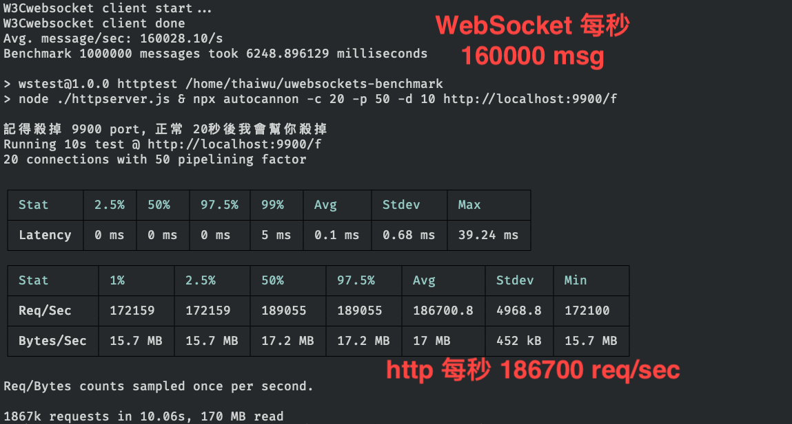
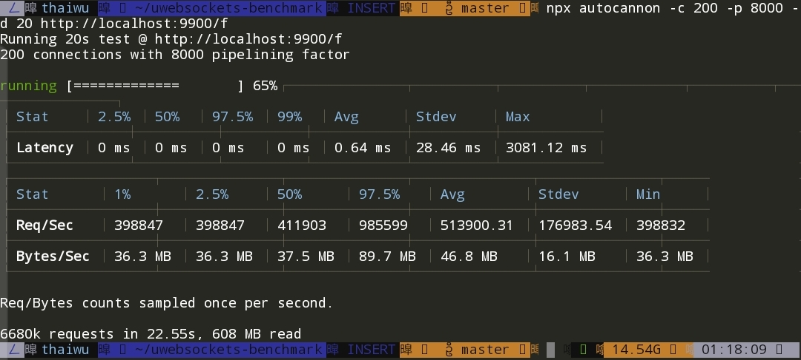

# uWebSockets-benchmark

## 初始化
```npm i``` or ```yarn install```
## 使用
```npm test```

## benchmark
- Linux 6核 12線程
- websocket 只用一條連線
<br>

## one nodejs instance

<br>

## use pm2 12 nodejs instance

<br>
